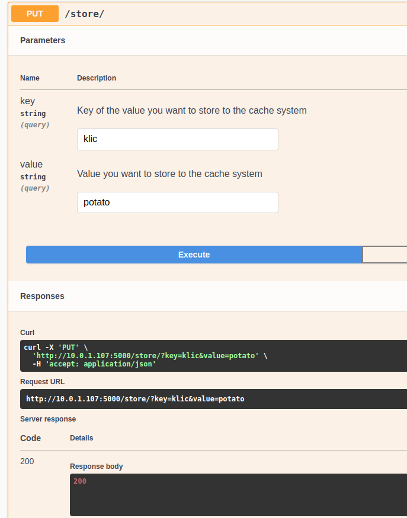
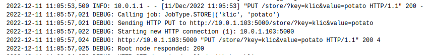
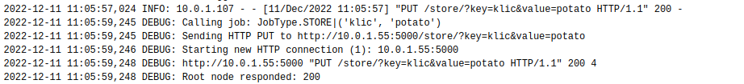
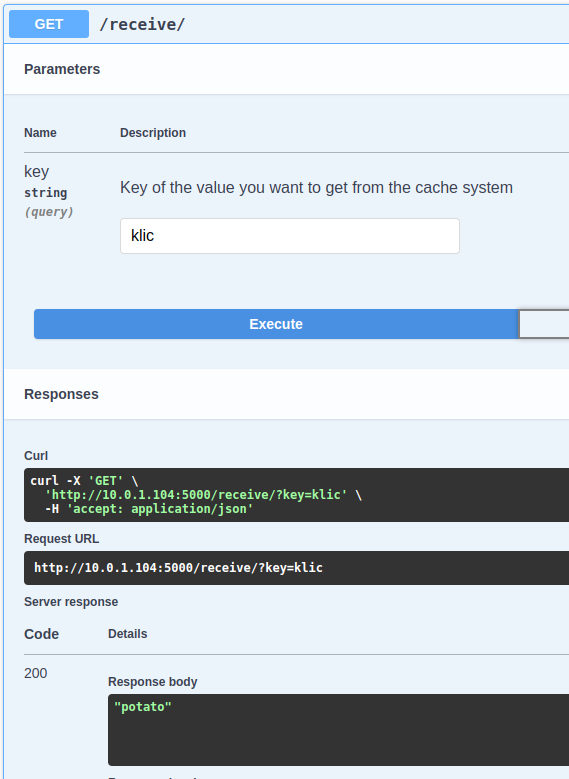
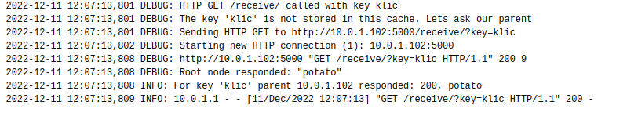
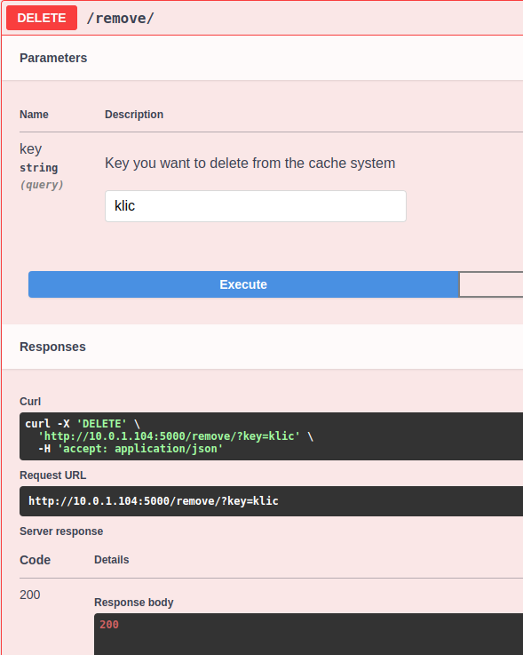
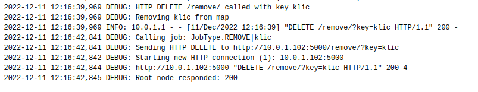
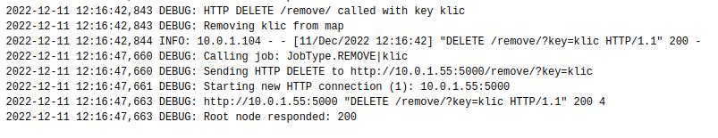
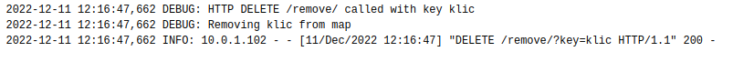
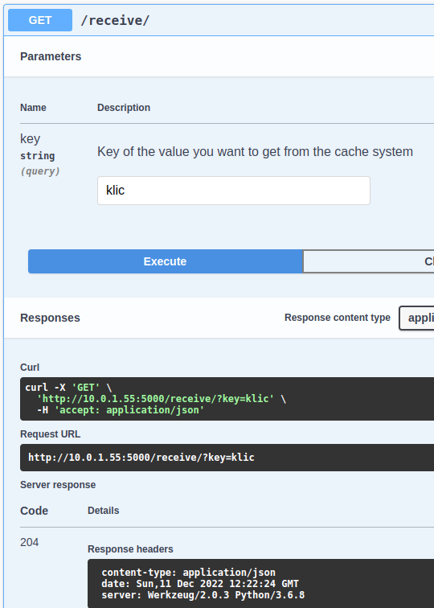

## 3. SAMOSTATNÁ PRÁCE KIV/DS

### Zadání:

Navrhněte distribuovanou aplikaci realizující distribuovanou cache se stromovou strukturou. Jedná se o binární strom,
kde počet úrovní bude 3 nebo 4. Počet úrovní je volitelný pomocí konfiguračního parametru, stejně jako identifikace
(IP adresa nebo jméno) kořenového uzlu. Hierarchická struktura cache bude evidována jako odpovídající model v
Apache Zookeeper.

### Základní podmínky:
- V konfiguraci (parametr ve Vagrantfile) bude možné definovat, který uzel bude kořen stromu a kolik úrovní
stromu má být vytvořeno.
- Počet úrovní binárního stromu je konfigurovatelný a může být buď 3, nebo 4 (včetně kořene)
- Po startu systému se všechny vytvořené uzly připojí ke kořenovému, s jehož pomocí vytvoří stromovou
strukturu, jejíž aktuální stav bude zaznamenám v odpovídajícím modelu Zookeeperu

- Apache Zookeper využijte pouze pro evidenci stromové struktury cache, nikoli k implementaci key-
value úložiště.

- Funkce stromové cache:
  - každý uzel pracuje jako jednoduchý key-value store, který implementuje pomocí REST API tři
základní op.erace PUT, GET a DELETE
  - primární kopii dat udržuje kořenový uzel, ostatní uzly pracují jako cache.
  - Funkce operace GET: pokud daný uzel (list nebo jeho nadřazený uzel) nezná hodnotu klíče, dotáže se
na ni svého nadřazeného uzlu. Dotaz se takto může rekurzivně dostat až ke kořenovému uzlu, který
odpoví buď tím, že klíč opravdu neexistuje, popř. odpoví celým key-value záznamem, který si
dotazující se uzel uloží do svojí cache. Znamená to, že pokud se takto dotáže uzel, který je listem,
uloží se vrácený záznam key-value do všech uzlů, které jsou na cestě ke kořenovému.
  - Operace PUT: funguje stejným způsobem jako GET a je tedy propagována až do kořene, jen s tím
rozdílem, že uzel nečeká až hodnota bude uložena na kořenovém uzlu, ale pouze na jeho nadřazeném
uzlu.
  - Operace DELETE: funguje stejným způsobem jako PUT.
- Implementované REST API popište pomocí OpenAPI, viz https://swagger.io/resources/open-api/
- Realizuje i jednoduchou klientskou aplikaci, pomocí které se lze z příkazové řádky provádět uvedené 3
operace na libovolném uzlu.
- Ze způsobu funkce popsané hierarchické cache je zřejmé, že chybí mechanismus pro zajištění tvz. „cache
coherence“. Změny (PUT a DELETE) jsou propagovány pouze směrem nahoru ke kořenovému uzlu, nikoliv
do ostatních větví stromu. Provedťe úvahu o tom, jak by bylo možné v tomto modelu zajistit cache
coherence. Nejdříve sami definujte podmínky (např. rychlost konvergence, požadavky na aktuálnost
dat, apod.) a pak na jejich základně navrhněte řešení.

### Technické podmínky

- Využití nástrojů Vagrant a Docker pro vytvoření a spuštění infrastruktury.
- Sestavení aplikace musí být možné v prostředí Unix/Linux


# Popis implementace

Výsledná aplikace slouží jako distribuovaná cache nabývající logickou podobu binarní stromu.
Počet úrovní stromu a adresa root uzlu je možné nastavit pomocí parametru (dále sekce <a href="#setup">Sestavení a spuštění</a>)    
Při spouštění uzlů dochází k postupnému připojování k root uzlu, který jim pak přiřazuje rodičovskou adresu ke které se budou hlásit.
Root uzel si interně vede stromovou strukturu do které pak při přihlášení přidává nové uzly a podle toho navrací rodičovskou adresu (endpoint ``/getParent/``)


### Definované endpointy

```/store/``` - zástupce operace **PUT** 

```/receive/``` - zástupce operace **GET** 

```/remove/``` - zástupce operace **DELETE** 

### Open API

Součástí aplikace je i knihovna ```flask_restx```, která dokáže ze standardní **Flask** signatury vygenerovat žádaný ```swagger.json```.
Pro přidání endpointu do výsledného JSONu je třeba označit novou třídu pomocí ```
@api.route("/endpoint-name/")```, kde metody jsou pojmenovány podle standardních operací (get, put, post...) a s přidanou dokumentací můžou vypadat následovně:
```
 @api.doc(
        params={
            'param1': 'Explanation of the usage for the 1st param',
            'param2': 'Explanation of the usage for the 2nd param'
                },
        responses={
            200: "Success",
            400: "No values/no valid values passed"
            204: "Request was ok, but no value found"
        }
    )
    def put(self):
```
Je třeba počítat s tím, že ke generaci tohoto souboru při přístupu dochází pouze pokud běží Flask v debug modu.


Získat ```swagger.json``` můžeme například přes webový prohlížeč při přístupu na adresu jednoho z cache uzlů (např. ``10.0.1.55:5000``)


### Zookeeper
Při nastartování clientské aplikace se uzel připojí k běžícímu Zookeeper kontejneru (adresa 10.0.1.100) pomocí **KazooClient** jenž byl zmínen na přednáškách předmětu.
Pokud se jedná o kořenový uzel, vytvoří svůj záznam v kořenu stromu se svojí přiřazenou IP adresou. 
V opačném případě se nejdříve pomocí **BFS** pokouší nálézt adresu svého rodiče a při nalezení se zařadí ve stromové struktuře pod svého rodiče.
Pokud však ještě neexistuje záznam rodiče, chvilku se uzel uspí a tento proces hledání opakuje ještě čtyřikrát.
Na následujícím obrázku je možné zahlédnout stromovou strukturu, která byla vytvořena ze čtyř úrovňového binarního stromu (výpisu je možné dosáhnout při spuštění přiloženého skriptu ```test.py```).


## [Sestavení a spuštění](#setup)

Pro sestavení aplikace je potřeba mít na daném přístroji nainstalované nástroje **Docker** a **Vagrant**. 
Aplikaci je pak možné sestavit pouze zadáním příkazu ``vagrant up`` do terminálu. 
V souboru **VagrantFile** na řádce **30** je možné v proměnné **TREE_LEVEL** nastavit počet úrovní/vrstev binárního stromu.

Po vyzkoušení této aplikace je pak možné spustit příkaz ``vagrant destroy -f`` pro vymazání vytvořené infrastruktury.
Nebo pro znovu sestavení systému pomocí ``sh rebuild.sh``, kde tento skript se také nachází v kořenové složce tohoto programu.


## Testování aplikace

### Swagger / Open API
Jedním z možných způsobů otestování implementovaných funkcí aplikace je pomocí **Swaggeru** jenž byl popsán v kapitole **Popis implementace -> Open API**.
Každý uzel generuje při přístupu na jejich přiřazenou adresu soubor **swagger.json**, který stručně popisuje všechny endpointy implementovaného API.
Například při připojení ke kořenovému uzlu skrze webový prohlížeč na adrese ``10.0.1.101:5000`` získáme následující odpověd:


### Terminál

Součástí řešení je i ve složce *client/terminal* skript, který slouží k otestování jednotlivých endpointů. Při sestavování se přibaluje k rodičovskému docker containeru. Využívá systémových proměnných, které používá pro identifikaci všech možných adres na které můžou být zasílány HTTP požadavky. Tudíž je potřeba tento script spustit při připojení k docker terminálu rodičovského kontejneru. Skript se v kontejneru nachází na ve složce /opt/terminal/ a může být spušten pomocí příkazu ``/usr/bin/python3 /opt/terminal/main.py``.

Po spuštění vypíše program všechny dostupné uzly a je možné do něj zadávat následující příkazy:

- put <node_id> <key> <value>
  - přidání/přepsání záznamu do stromové struktury 
- get <node_id> <key>
  - vypsání hodnoty k předanému klíči
- delete <node_id> <key>
  - odstranění klíče ze stromové struktury
- exit
  - ukončení programu

kde:
- \<node_id> je id uzlu na který bude zasílána žádost. Id uzlu se určuje podle seznamu, který program vypsal při spuštění. Indexuje se od 0.
- \<key> klíč pod kterým chce uživatel přistupovat k hodnotě
- \<value> hodnota kterou chce uživatel uložit


### Postup testování

Po spuštění cache systému dochází root uzlem k přiřazování adres:


Po přiřazení adres se jednotlivé uzly pokouší (maximálně 5x) zaregistrovat do ZooKeeperu pod konfigurací stanoveného rodiče.


Jakmile dojde k registraci u Zookepera, začne aplikace poslouchat na adrese, která byla přiřazena přes systémové proměnné.


Předpokládáme-li že máme strom se třemi úrovněmi, můžeme vložit hodnotu do jednoho z nejzanořenějších uzlů.
Využijeme k tomu funkcionalitu vygenerovaného Swaggeru. Přidáme klíč "klic" s hodnotou "potato":



V logu jednotlivých uzlů můžeme spatřit, že hodnota "probublává" až k rodičovskému uzlu:
10.0.1.107 (client-7):

10.0.1.103 (client-3):

10.0.1.55 (rootclient-1):


Nyní můžeme z uzlu z "opačné" strany stromu zavolat metody GET:



V logu opět můžeme spatřit jak se jednotlivé hodnoty získávájí od rodičovských uzlů:
10.0.1.104 (client-4):

10.0.1.102 (client-2):

10.0.1.55 (rootclient-1):


Nakonec můžeme zkusit funkci DELETE, která odstraní záznam "klic"":



10.0.1.104 (client-4):

10.0.1.102 (client-2):

10.0.1.55 (rootclient-1):



Nyní po odstranění se můžeme dotázat rodičovského uzlu o hodnotu pod klíčem "klic". 
Od něj však získáme návratový kód 204, tudíž hodnota se již v cache nenachází:



Hodnota se však ještě nachází ve větvy ve které nedošlo k aktualizaci.
Možné řešení tohoto problému je zmíněno v následující sekci.

## Cache coherence

Jednou z možných a lehce proveditelných způsobů aktualizace cache může být periodické dotazování rodičovského uzlu.
Aby však nedocházelo při každém dotazu k přepisování celé cache, musel by si rodičovských uzel ukládat seznam změn, které nebyly propsány do jednotlivých potomků.
To by však navýšilo pamětovou náročnost célé aplikace. V naše malém a nenáročném úkolu by se něco takového jentak neprojevilo.
Problém by mohl nastat až u řádově větších systémů.

Rodičovský uzel by si tedy ukládal mapu s posledními změněnými klíčy, kde hodnoty k těmto klíčům by značily kteří potomci si musí tuto hodnotu aktualizovat při dalším dotazu.
Potomek by se pak periodicky dotazoval rodiče, který by mu poskytnul seznam klíčů, o které si musí opětovně zažádat. 
Pokud má pod sebou další potomky, tak tyto hodnoty uloží do mapy ve stejném principu jako jeho rodič.
Změny se tak postupně projeví v každém z uzlů.  

